---

### 2)
Odhad koeficientu l_lotsize s intervaly spolehlivosti: $0.2454$. Vypočet intervalu spolehlivosti: 
$$0.2454 \pm  1.96 * 0.0669$$

---
### 3 
#### a)

...

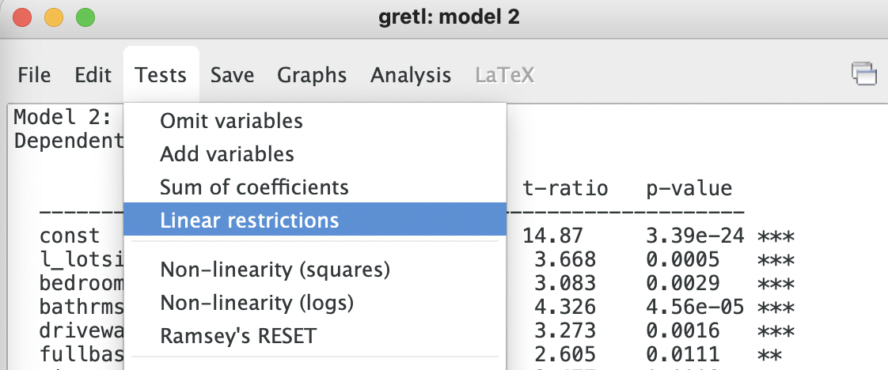
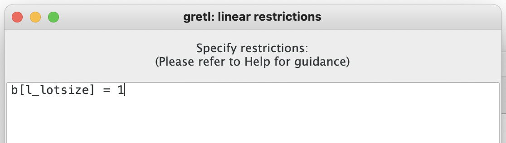
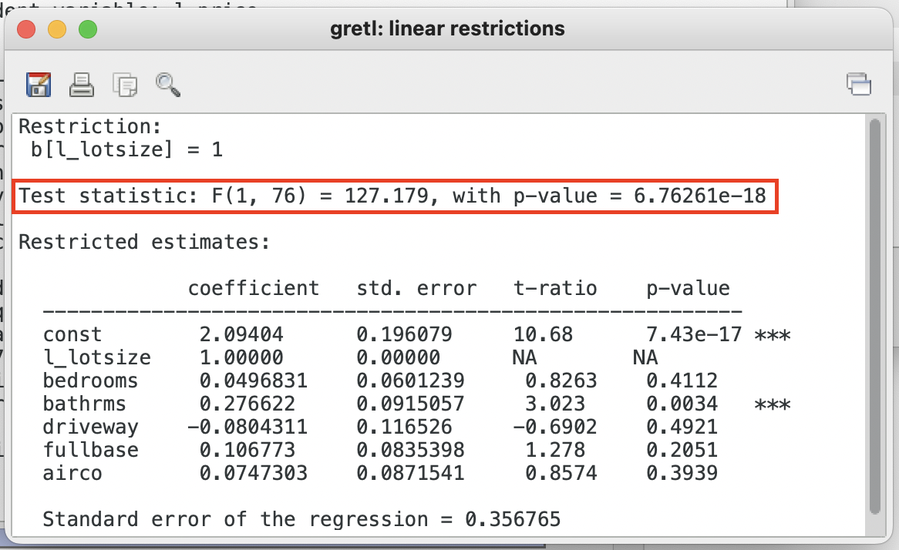

...

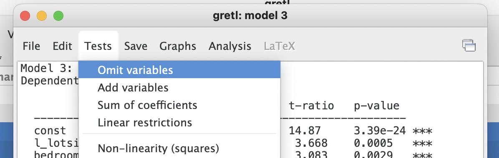

...

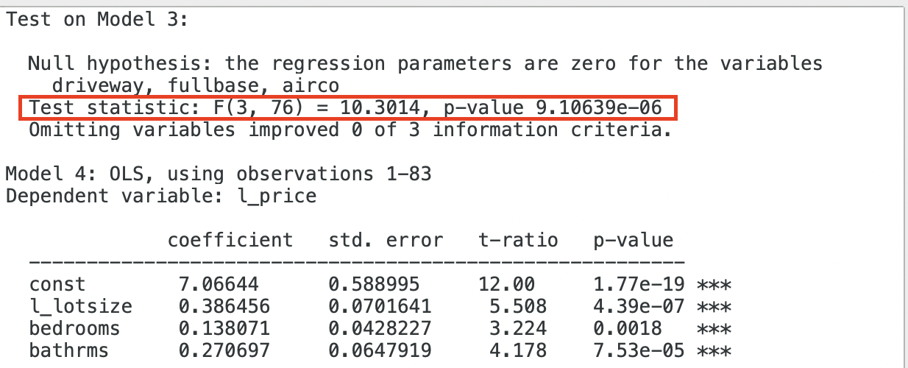

...

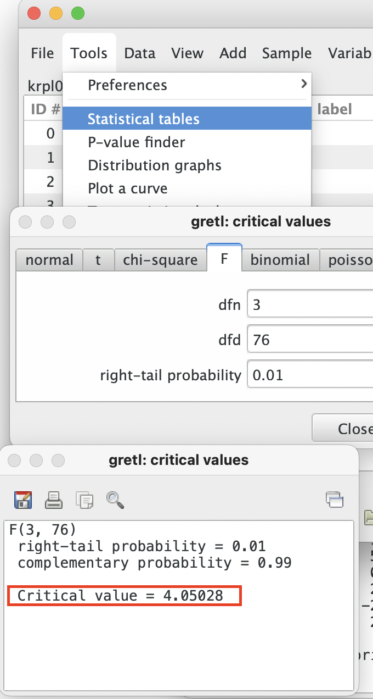

...

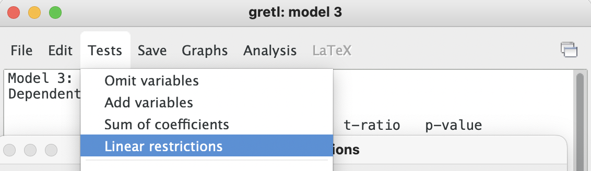
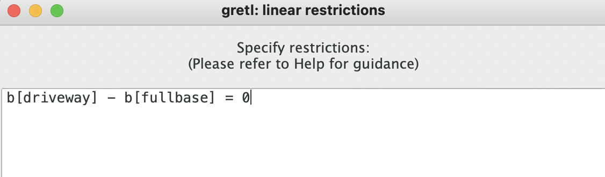
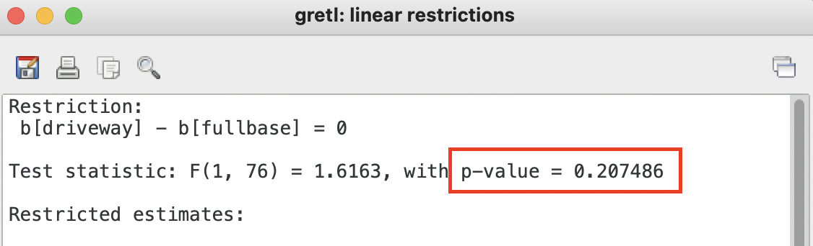

...

...

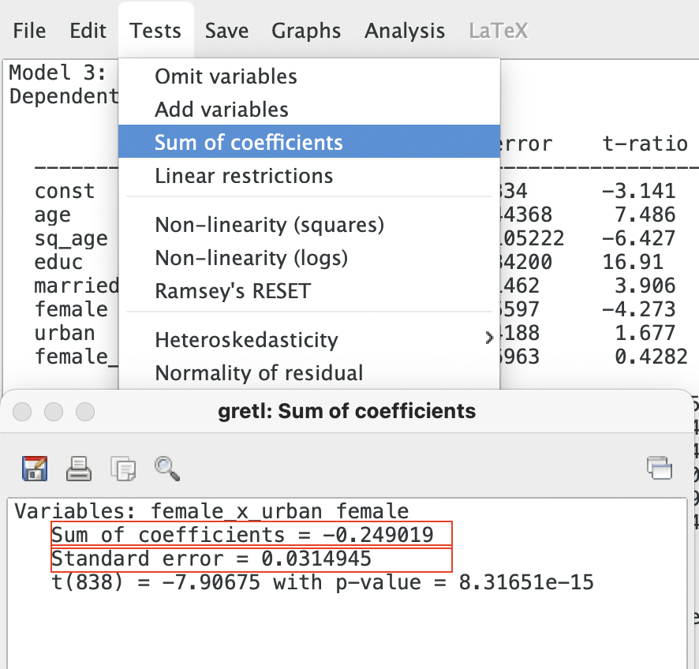

...

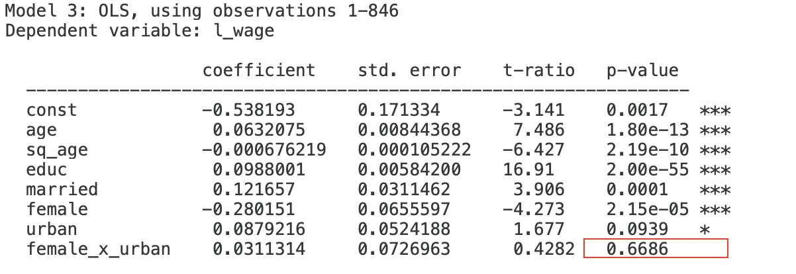

...
