# 1. Domácí Úkol

**Autor:** Dominik K.
**Datum:** 16/12/2023

---

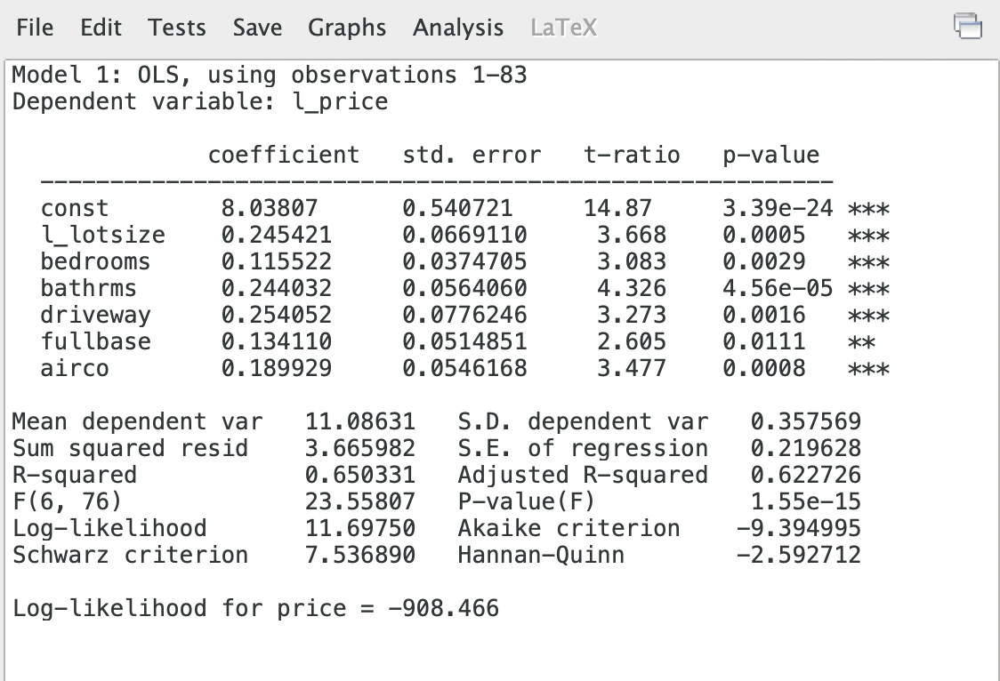

### 2)
Odhad koeficientu l_lotsize s intervaly spolehlivosti: $0.2454$. Výpočet intervalu spolehlivosti: 
$$
0.2454 \pm  1.96 \times 0.0669
$$

---
### 3 
#### a)

Test, zda jsou domy se sklepem dražší ve srovnání s vhodně zvolenou *jednostrannou* alternativou:

$$H_0: \beta_5 = 0$$

$$H_1: \beta_5 < 0$$

Výpočet p-hodnoty:  

$$\text{p-hodnota testu} = \frac{\text{p-hodnota \textit{fullbase}}}{2} = 0.00555$$

Zamítáme $H_0$ na 5% hladině významnosti.

---

### 4
#### a)  

Otázka: Je elasticita ceny domu vzhledem k rozloze jeho pozemku rovna jedné?

$$
H_0: \beta_1 = 1 \\
H_1: \beta_1 \neq 1
$$

**Dva způsoby:**
- t-test 
- test lineárních restrikcí (F-test)

#### b) 
Výpočet t-statistiky pro nulovou hypotézu (a):  
$$
\text{t-statistika} = \frac{\hat{\beta}_1 - 1}{\text{se}(\beta_1)} = -11.28
$$

Test lineárních restrikcí v Gretlu:

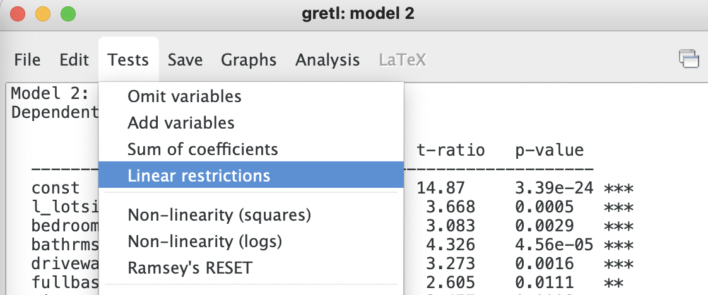
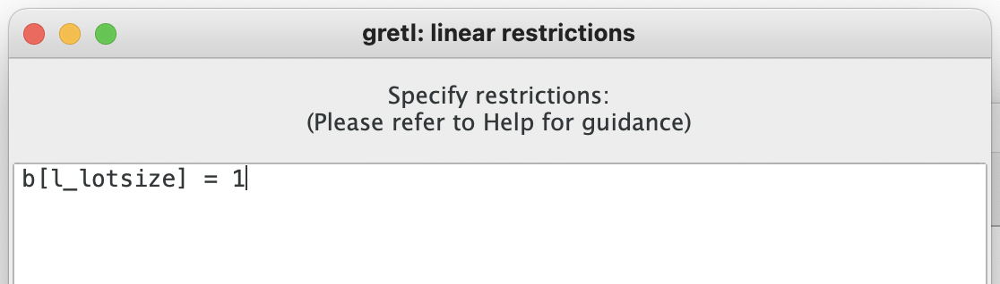
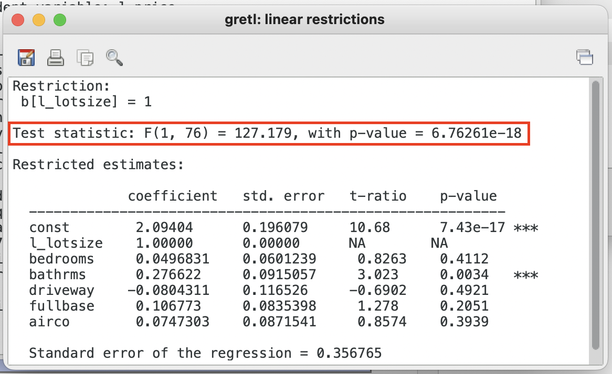

Závěr: Zamítáme $H_0$ na 1% hladině významnosti.

---
#### 5.

Test sdružené významnosti dummy proměnných:

V Gretlu v Modelu: testy > vynechání proměnných a tam zvolte všechny dummy proměnné v modelu:

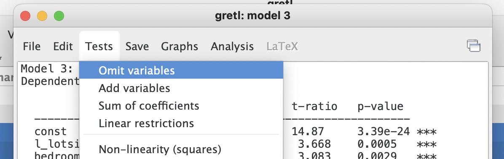

Výsledek:

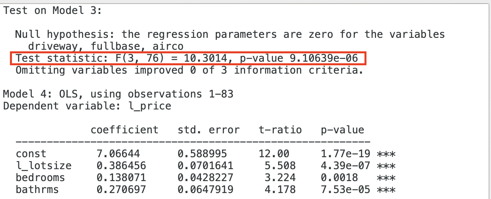

#### a)
$F$-stat. = 10.3

#### b)
DF1 (čitatel F statistiky): 3

#### c) 
DF2 (jmenovatel): 76 

#### d) 
Kritická hodnota z tabulek:

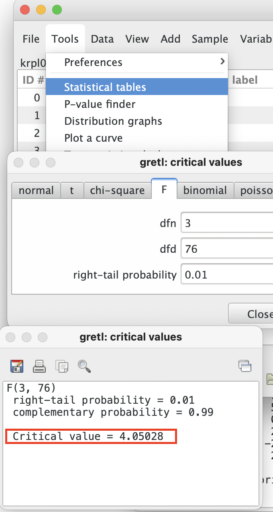

#### e)
Zamítáme $H_0$ na 1% hladině významnosti.

---

### 6.
Test, zda má příjezdová cesta stejný vliv na cenu jako sklep.

#### 6. a)
$$
H_0: \beta_4 = \beta_5 \\
H_1: \beta_4 \neq \beta_5
$$

#### 6. b) 
Opět v původním odhadnutém modelu: Testy > lineární restrikce:

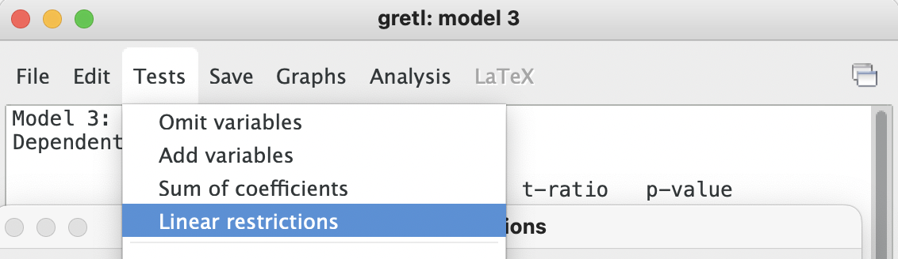
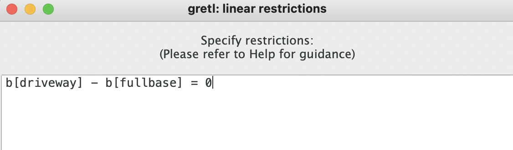
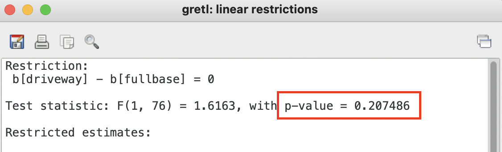

#### 6. c)
Nezamítáme $H_0$ na 5% hladině významnosti.

---
### 7.

Model:

$$\log(\text{wage}) = \beta_0 + \beta_1 \times \text{age} + \beta_2 \times \text{age}^2 + \beta_3 \times \text{educ} + \beta_4 \times \text{married} + \beta_5 \times \text{female} + \beta_6 \times \text{urban} + \beta_7 \times (\text{female} \times \text{urban}) + u$$

#### 7.a)

Bod zlomu a tvar: potřebujeme získat $\hat{\beta}_2$ a $\hat{\beta_3}$:

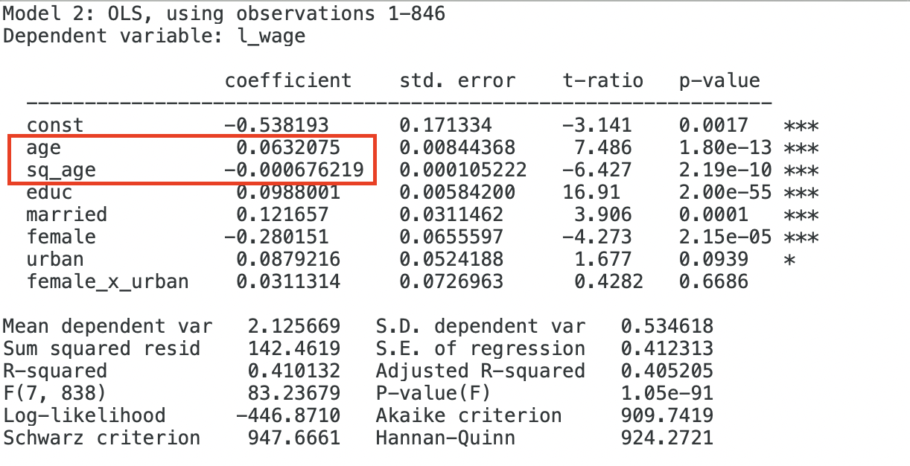

Podmínka pro maximum vzhledem k proměnné *age*:  
$$
\frac{\partial \log(\text{wage})}{\partial \text{age}} = 0
$$

$$
0.0632 + 2 \times -0.000676 \times \text{age} = 0
$$

Vyjádřením *age* získáme bod zlomu v efektu věku na logaritmickou mzdu:  
$$
\text{age} = 46.74
$$

### 8
#### 8.a)

Je dán aproximativní vztah:  
$$
\% \Delta \approx 100 \times (\beta_1 + 2 \times \beta_2 \times \text{age} \times \Delta \text{age})
$$

Zde je podle zadání:

*"Najděte mezní efekt třicátého a dvaačtyřicátého roku života na mzdu (efekt jednoho dodatečného roku stáří pro dva různé referenční věky)".*

#### 8. b)
Mezní efekt dodatečného roku při 30 letech věku:

$$
\% \Delta \approx 100 \times (\beta_1 + 2 \times \beta_2 \times \text{age} \times \Delta \text{age})
$$
$$
100 \times (0.0632 + (2 \times -0.000676 \times 30)) = 2.263\%
$$

#### 8. c)
Mezní efekt dodatečného roku při 42. letech věku:

$$
\% \Delta \approx 100 \times (\beta_1 + 2 \times \beta_2 \times \text{age} \times \Delta \text{age})
$$
$$
100 \times (0.0632 + (2 \times -0.000676 \times 42)) = 0.6405 \%
$$

---

### 9.
#### 9. a) 

Efekt pro vesnici: 

$$
(e^{\hat{\beta}_5}-1)\times100
$$
$$
(e^{-0.28}-1 )\times100 = -24.42 \%
$$

#### 9. b)

Efekt pro město:

$$
(e^{\hat{\beta}_5 +\hat{\beta}_7} - 1) \times 100
$$
$$
(e^{-0.28 + 0.031}- 1) \times 100  = 22.04 \%
$$

#### 9. d) 
Interval spolehlivosti pro součet parametrů:

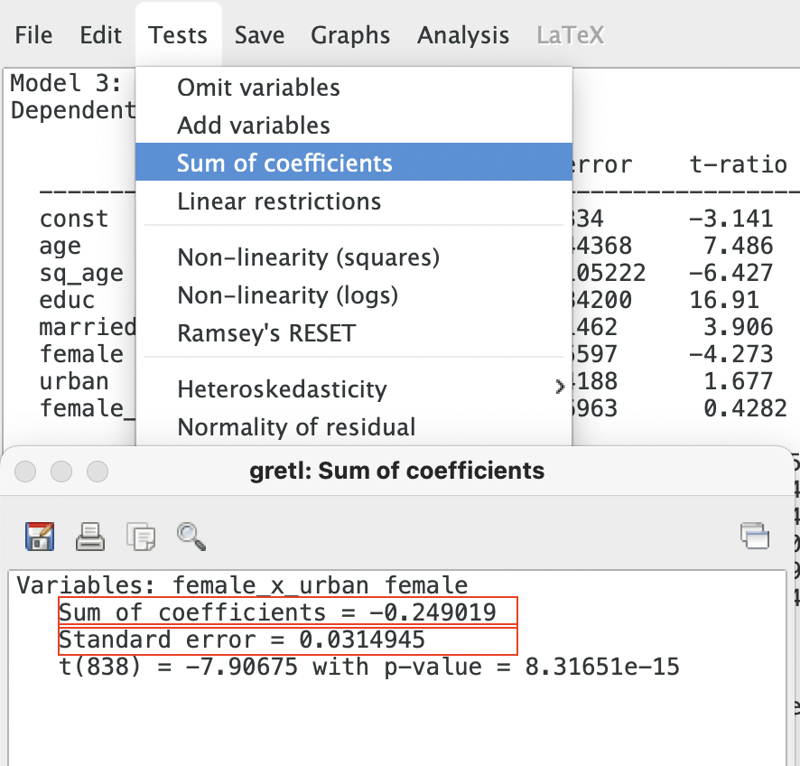

$$
\text{CI spodní mez }= (e^{-0.249 - 1.96 \times 0.031} - 1 ) \times 100
$$
$$
\text{CI spodní mez }= -26.72 \%
$$

$$
\text{CI horní mez }= (e^{-0.249 + 1.96 \times 0.031} - 1 ) \times 100
$$
$$
\text{CI horní mez }= -17.07 \%
$$

---

### 10.

#### 10. a

$$
H_0:\; \beta_7 = 0
$$
$$
H_1:\; \beta_7 \neq 0
$$

#### 10. b)

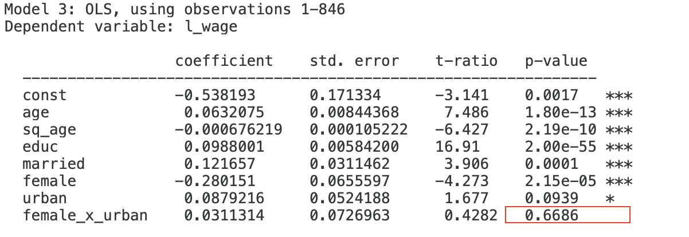

#### 10. c)

Nezamítáme $H_0$.
